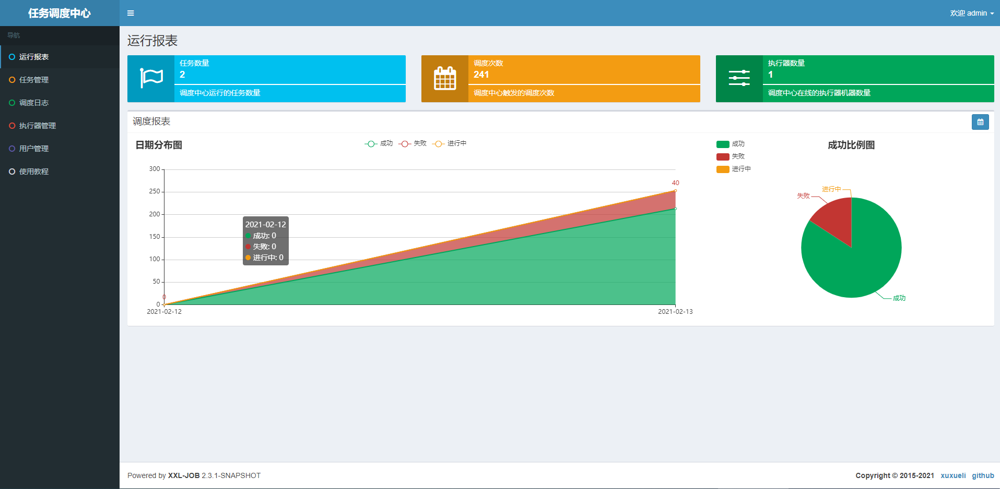
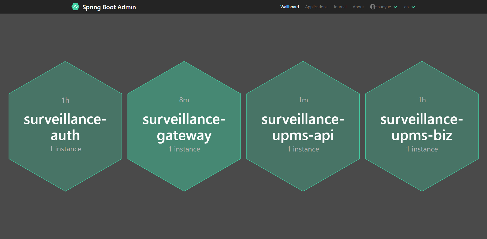
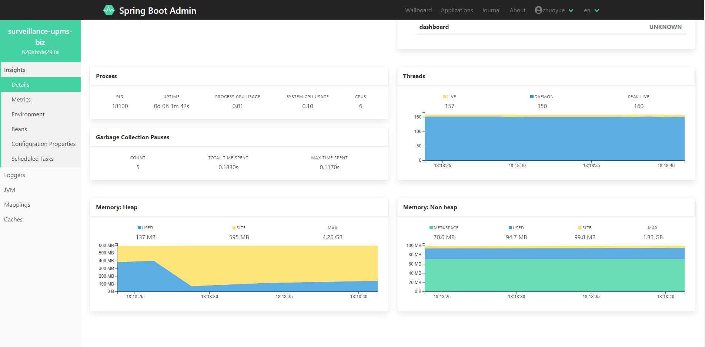
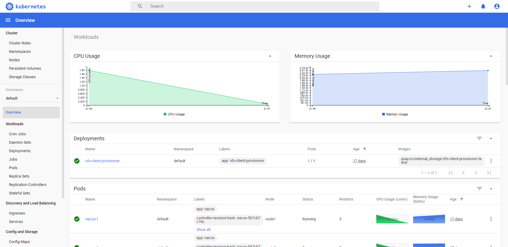

# video_surveillance2021致力于打造企业级通用PaaS平台
> video_surveillance2021是新版video_surveillance。新版基于SpringCloud Hoxton + Spring Cloud Alibaba构建微服务架构,基于TypeScript + Vue3.0构建前端

video_surveillance2021的前端项目: [video_surveillance2021_vue3](https://github.com/fuyunwang/video_surveillance2021_vue3)

# 系统设计之道

- 高性能，容错，可扩展，数据一致性，负载均衡，心跳，通信，安全，网络I/O。

- 分布式（不管是微服务还是服务网格）内部链路通信多采用rpc而不起http。具体要考虑的有：序列化，网络io，连接管理，心跳健康检测，路由负载均衡，异常重试及快速失败，服务分组，熔断限流，服务发现，异步队列，事件解耦，责任链模式实现可插拔，代理模式实现隐藏复杂底层逻辑。

- 问题的考虑应该从两个层面入手，即机器层面和网络层面，而网络层面主要包括网络分区，网络故障，网络延迟。网络方面的问题解决可以参考两种手段，一是基于分布式锁避免死锁的超时手段，二是基于https证书颁发的方式引入第三方权威机构。

- 我认为的三高主要是包括：高性能，高可用和高可扩展。其中高性能应该包括高并发实现大吞吐量，基于复制手段的复制策略实现高可用并保证有效的数据一致性，如何基于架构规范和设计模式来保证高可扩展。高并发主要手段：静态资源CDN化、动静分离、客户端排队与答题、多级缓存、消息队列异步、分布式化即服务拆分实现并行计算、服务熔断、服务降级、限流、削峰、做好服务隔离、做好风险控制、做好兜底策略

# 项目实现(请科学上网以查看效果图)

## 技术要点

1. Spring Boot 2.3.6.RELEASE
2. Spring Cloud Hoxton.SR9
3. Spring Cloud Alibaba
4. Spring Cloud Security
5. Spring Cloud Oauth2
6. MyBatis-Plus
7. Spring Cloud OpenFeign
8. Spring Cloud Alibaba Nacos
9. Spring Cloud Alibaba Sentinel
10. Spring Boot Admin
11. Spring Cloud Bus
12. 消息中间件:  RocketMQ、Kafka
13. 日志处理:   ELK
14. 链路追踪:   Skywalking APM
15. 监控告警:   Prometheus + Grafana
16. 定时任务:   Xxl-Job
17. 分布式事务:   Seata
18. 分库分表:   ShardingSphere
19. 分布式文件存储:   FastDFS + OSS
20. 服务器:   Tomcat、Jetty、Nginx + OpenResty + Lua
21. 数据库:   MySQL、Redis、MongoDB、ElasticSearch
22. 运维CI/CD:   Jenkins + Docker + Kubernetes

## 常见问题解决方案

1. 分布式ID:
> 基于雪花算法实现分布式ID生成

2. 分布式Session:
> jwt token作分布式session的解决方案，oauth2作授权协议

3. 分布式事务: 
> 基于阿里Seata组件实现分布式事务

4. 分布式锁:
> 基于Redission实现分布式锁

5. 分布式接口幂等性和分布式限流: 
> 基于Sentinel实现分布式限流

6. 分布式文件存储:
> 基于FastDFS实现作分布式小文件存储

7. 分布式任务调度:
> 基于Xxl-Job实现分布式任务调度

8. 分库分表: 
> 基于ShardingSphere实现分库分表

## 高并发与高可用

### 系统设计

1. MySQL

    1. MySQL读写分离
    2. MySQL分库分表

2. Redis
    
    1. Redis缓存穿透
    2. Redis缓存雪崩
    3. Redis缓存击穿
    4. Redis缓存与数据库的双写一致性保障

### 中间件集群及性能调优

## 架构图

## Xxl-Job

## Spring Boot Admin

## Metrics Monitor

## Trace Monitor

## kubernetes dashboard

## Postman Api

# 环境部署
## Docker
### CentOS7安装Docker、Docker Compose
> 分别执行以下命令,纯净版的CentOS7 最好先yum update

#### 调整时区
1. yum -y install ntp
2. ntpdate ntp1.aliyun.com
3. timedatectl set-timezone Asia/Shanghai

#### Docker Install
1. yum install -y yum-utils \
     device-mapper-persistent-data \
     lvm2
2. yum-config-manager \
       --add-repo \
       https://download.docker.com/linux/centos/docker-ce.repo
3. yum -y install docker-ce-19.03.1 docker-ce-cli-19.03.1 containerd.io
4. systemctl enable docker && systemctl start docker
5. vi /etc/docker/daemon.json
    
   `{
      "registry-mirrors": [
        "https://dockerhub.azk8s.cn",
        "https://reg-mirror.qiniu.com",
        "https://registry.docker-cn.com"
      ]
    }`
6. systemctl daemon-reload
7. systemctl restart docker

#### Docker Compose Install
1. sudo curl -L "https://github.com/docker/compose/releases/download/1.25.0/docker-compose-$(uname -s)-$(uname -m)" -o /usr/local/bin/docker-compose
2. sudo chmod +x /usr/local/bin/docker-compose
3. sudo ln -s /usr/local/bin/docker-compose /usr/bin/docker-compose

## IDEA配置Docker插件
1. 远程服务器 vi /lib/systemd/system/docker.service
2. [Service] 
   
   ExecStart=/usr/bin/dockerd -H tcp://0.0.0.0:2375 -H unix://var/run/docker.sock
3. systemctl daemon-reload 
4. systemctl restart docker.service
5. 192.168.1.100:2375/info

## Kubernetes

1. hostnamectl set-hostname master

2. 
   `

        kubeadm init --kubernetes-version=1.19.2 \
        --apiserver-advertise-address=192.168.1.3 \
        --image-repository registry.aliyuncs.com/google_containers \
        --service-cidr=10.1.0.0/16 \
        --pod-network-cidr=10.244.0.0/16

   `

3. mkdir -p $HOME/.kube

4. sudo cp -i /etc/kubernetes/admin.conf $HOME/.kube/config

5. sudo chown $(id -u):$(id -g) $HOME/.kube/config

6. echo "export KUBECONFIG=/etc/kubernetes/admin.conf" >> ~/.bash_profile

7. kubectl apply -f ./flannel.yaml

8. ifconfig |grep flan

9. kubectl get po -n kube-system

## End
> Coding不易，点个star吧 ^=^。当然如果此项目有帮助到你，你也可以请我吃糖

