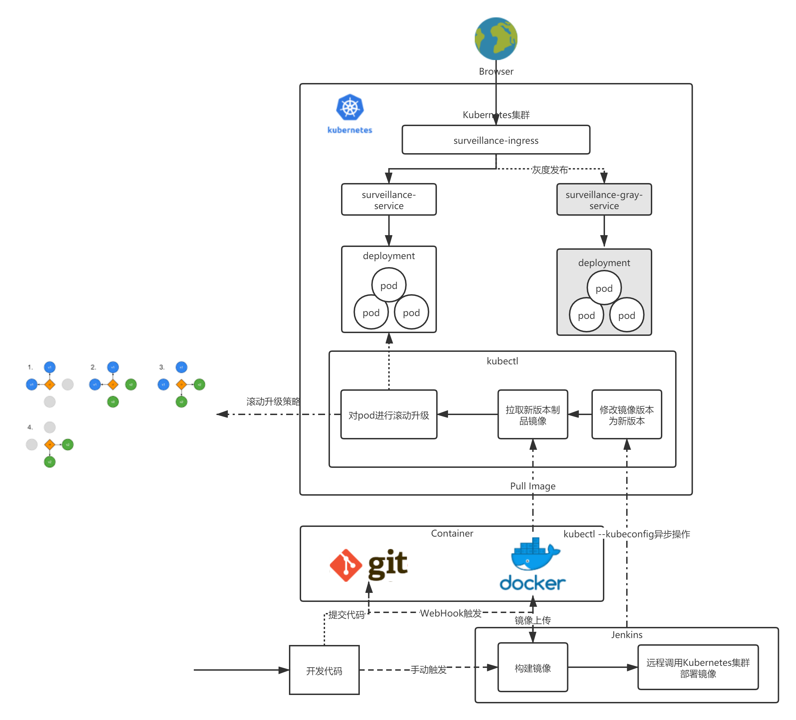

# video_surveillance
> video_surveillance2021是新版video_surveillance。新版基于SpringCloud Hoxton构建微服务架构,基于TypeScript + Vue3.0构建前端

# 项目实现

## 技术要点

1. Spring Boot 2.3.6.RELEASE
2. Spring Cloud Hoxton.SR9
3. Spring Cloud Alibaba
4. Spring Cloud Alibaba Nacos
5. Spring Cloud Security
6. Spring Cloud Oauth2
7. MyBatis-Plus
8. Spring Cloud Feign
9. Spring Cloud Sentinel
10. Spring Cloud OpenFeign
11. Spring Boot Admin
12. Spring Cloud Bus + Rabbitmq
13. 消息中间件:  RocketMQ
14. 日志处理:   logback + Kafka + ELK
15. 链路追踪:   Skywalking APM
16. 监控告警:   Prometheus + Grafana
17. 限流: OpenResty + lua
18. 定时任务:   Elastic-Job
19. 分布式事务:  Seata
20. 分库分表: Sharding-JDBC
21. Nginx、Tomcat、Redis、MySQL、MongoDB
22. 运维CI/CD:    Jenkins + Docker + Kubernetes

## 常见问题解决方案

1. 分布式ID:
> 基于美团Leaf组件实现雪花算法

2. 分布式Session:

3. 分布式事务: 

4. 分布式锁:

5. 分布式限流: 

6. 分布式文件存储:

7. 分布式任务调度:

8. 分库分表: 

## 高并发与高可用

## 架构图

# 环境部署
## Docker
### CentOS7安装Docker、Docker Compose
> 分别执行以下命令,纯净版的CentOS7 最好先yum update

#### 调整时区
1. yum -y install ntp
2. ntpdate ntp1.aliyun.com
3. timedatectl set-timezone Asia/Shanghai

#### Docker Install
1. yum install -y yum-utils \
     device-mapper-persistent-data \
     lvm2
2. yum-config-manager \
       --add-repo \
       https://download.docker.com/linux/centos/docker-ce.repo
3. yum -y install docker-ce-18.09.0 docker-ce-cli-18.09.0 containerd.io
4. systemctl enable docker && systemctl start docker
5. vi /etc/docker/daemon.json
    
   `{
      "registry-mirrors": [
        "https://dockerhub.azk8s.cn",
        "https://reg-mirror.qiniu.com",
        "https://registry.docker-cn.com"
      ]
    }`
6. systemctl daemon-reload
7. systemctl restart docker

#### Docker Compose Install
1. sudo curl -L "https://github.com/docker/compose/releases/download/1.25.0/docker-compose-$(uname -s)-$(uname -m)" -o /usr/local/bin/docker-compose
2. sudo chmod +x /usr/local/bin/docker-compose
3. sudo ln -s /usr/local/bin/docker-compose /usr/bin/docker-compose

## IDEA配置Docker插件
1. 远程服务器 vi /lib/systemd/system/docker.service
2. [Service] 
   
   ExecStart=/usr/bin/dockerd -H tcp://0.0.0.0:2375 -H unix://var/run/docker.sock
3. systemctl daemon-reload 
4. systemctl restart docker.service
5. 192.168.1.100:2375/info

## Kubernetes
