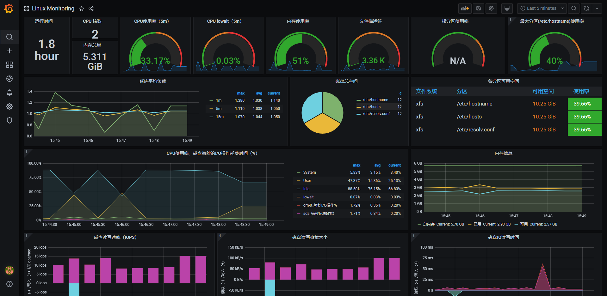
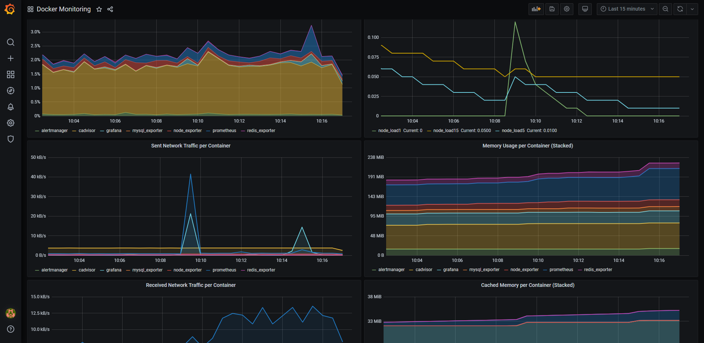
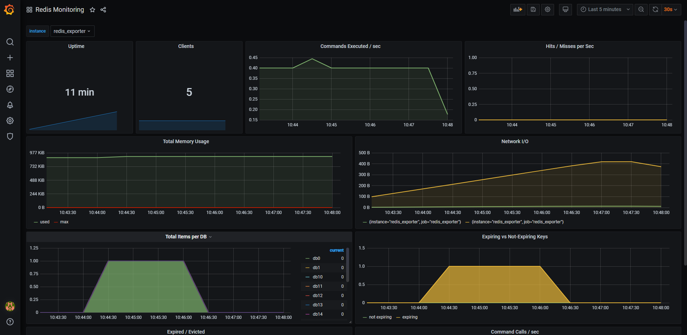
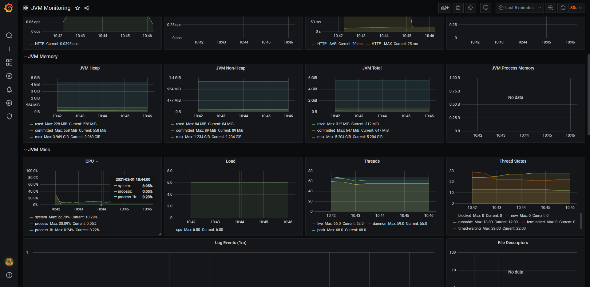
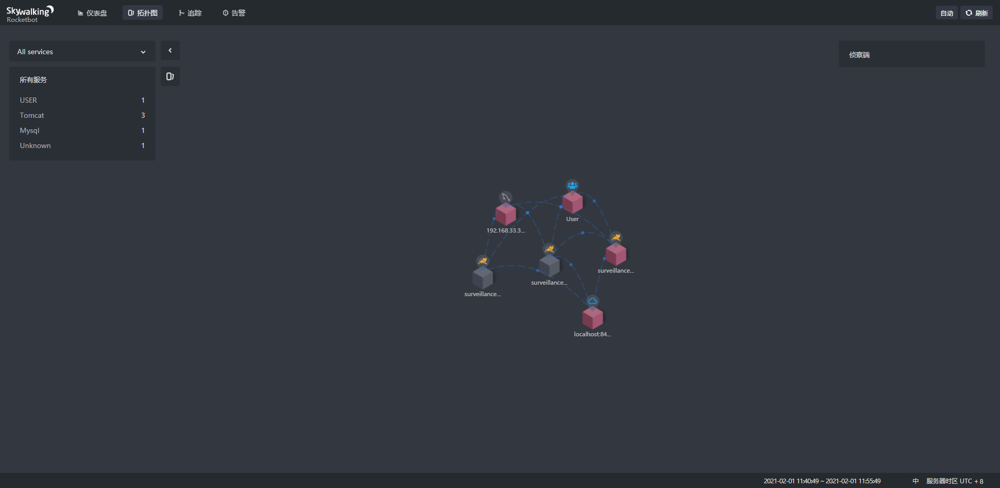
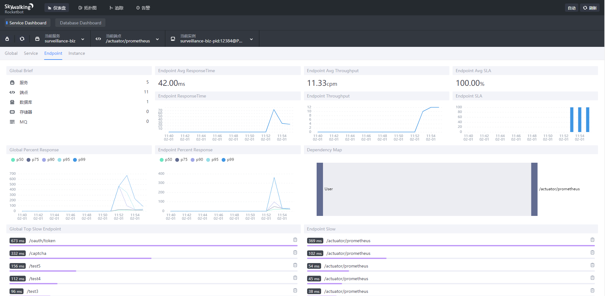
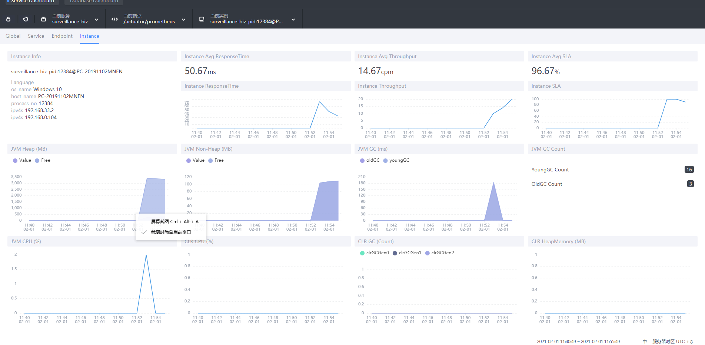
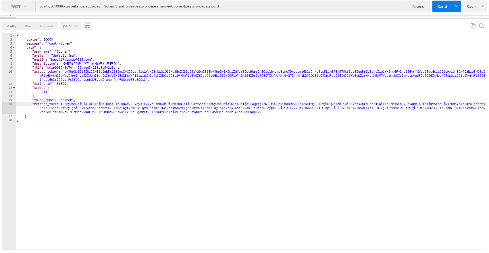

# video_surveillance
> video_surveillance2021是新版video_surveillance。新版基于SpringCloud Hoxton构建微服务架构,基于TypeScript + Vue3.0构建前端

## 致力于打造企业级通用PaaS平台

# 项目实现

## 技术要点

1. Spring Boot 2.3.6.RELEASE
2. Spring Cloud Hoxton.SR9
3. Spring Cloud Alibaba
4. Spring Cloud Security
5. Spring Cloud Oauth2
6. MyBatis-Plus
7. Spring Cloud OpenFeign
8. Spring Cloud Alibaba Nacos
9. Spring Cloud Alibaba Sentinel
10. Spring Boot Admin
11. Spring Cloud Bus + Rabbitmq
12. 消息中间件:  RocketMQ
13. 日志处理:   Filebeat + Logback + Kafka + ELK
14. 链路追踪:   Skywalking APM
15. 监控告警:   Prometheus + Grafana
16. 限流: OpenResty + Lua
17. 定时任务:   Xxl-Job
18. 分布式事务:  Seata
19. 分库分表:   Sharding-JDBC
20. 分布式文件存储:    FastDFS + OSS
21. 数据库与服务器:    Nginx、Tomcat、Redis、MySQL、MongoDB
22. 运维CI/CD:    Jenkins + Docker + Kubernetes

## 常见问题解决方案

1. 分布式ID:
> 基于美团Leaf组件实现雪花算法

2. 分布式Session:
> jwt token作分布式session的解决方案，oauth2作授权协议

3. 分布式事务: 
> 基于阿里Seata组件实现分布式事务

4. 分布式锁:
> 基于Redission实现分布式锁

5. 分布式接口幂等性和分布式限流: 
> 基于Sentinel实现分布式限流

6. 分布式文件存储:
> 基于FastDFS实现作分布式小文件存储

7. 分布式任务调度:
> 基于xxl-job实现分布式任务调度

8. 分库分表: 
> 基于Sharding JDBC实现分库分表

## 高并发与高可用

### 系统设计

1. Redis
    
    1. Redis缓存穿透
    2. Redis缓存雪崩
    3. Redis缓存击穿

### 中间件集群及性能调优

## 架构图

## Metrics Monitor

## Trace Monitor

## Postman Api

# 环境部署
## Docker
### CentOS7安装Docker、Docker Compose
> 分别执行以下命令,纯净版的CentOS7 最好先yum update

#### 调整时区
1. yum -y install ntp
2. ntpdate ntp1.aliyun.com
3. timedatectl set-timezone Asia/Shanghai

#### Docker Install
1. yum install -y yum-utils \
     device-mapper-persistent-data \
     lvm2
2. yum-config-manager \
       --add-repo \
       https://download.docker.com/linux/centos/docker-ce.repo
3. yum -y install docker-ce-19.03.1 docker-ce-cli-19.03.1 containerd.io
4. systemctl enable docker && systemctl start docker
5. vi /etc/docker/daemon.json
    
   `{
      "registry-mirrors": [
        "https://dockerhub.azk8s.cn",
        "https://reg-mirror.qiniu.com",
        "https://registry.docker-cn.com"
      ]
    }`
6. systemctl daemon-reload
7. systemctl restart docker

#### Docker Compose Install
1. sudo curl -L "https://github.com/docker/compose/releases/download/1.25.0/docker-compose-$(uname -s)-$(uname -m)" -o /usr/local/bin/docker-compose
2. sudo chmod +x /usr/local/bin/docker-compose
3. sudo ln -s /usr/local/bin/docker-compose /usr/bin/docker-compose

## IDEA配置Docker插件
1. 远程服务器 vi /lib/systemd/system/docker.service
2. [Service] 
   
   ExecStart=/usr/bin/dockerd -H tcp://0.0.0.0:2375 -H unix://var/run/docker.sock
3. systemctl daemon-reload 
4. systemctl restart docker.service
5. 192.168.1.100:2375/info

## Kubernetes

1. hostnamectl set-hostname master

2. 
   `

        kubeadm init --kubernetes-version=1.20.2 \
        --apiserver-advertise-address=192.168.1.3 \
        --image-repository registry.aliyuncs.com/google_containers \
        --service-cidr=10.1.0.0/16 \
        --pod-network-cidr=10.244.0.0/16

   `

3. mkdir -p $HOME/.kube

4. sudo cp -i /etc/kubernetes/admin.conf $HOME/.kube/config

5. sudo chown $(id -u):$(id -g) $HOME/.kube/config

6. echo "export KUBECONFIG=/etc/kubernetes/admin.conf" >> ~/.bash_profile

7. kubectl apply -f ./flannel.yaml

8. ifconfig |grep flan

9. kubectl get po -n kube-system
